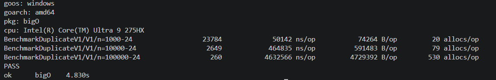
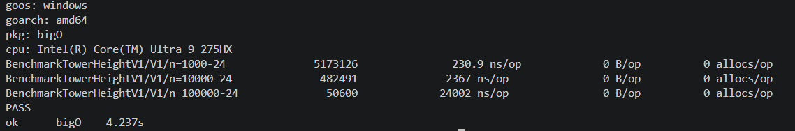
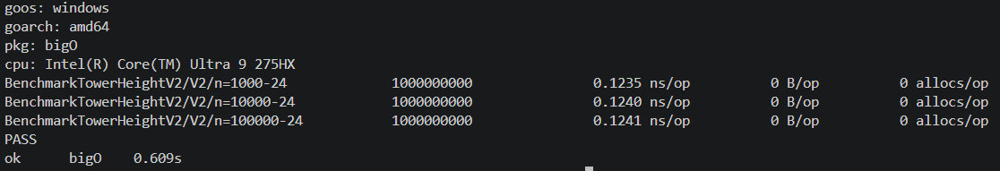

# TP - Complexité algorithmique en GO
-------------------------------------

lien github : https://github.com/Juuuules83/tp-kaplas.git

-------------------------------------

## PB01 - Le plus petit kapla :

### Question : et si la pile était déjà rangée, quelle serait la complexité ?

voici le résultat du benchmark 
-> 

nous sommes à un nombre d'opération de : O(n)
en raison du fait que c'est un slice que l'on parcours, 
la complexité est de niveau O(n)

Nous ne pouvons pas la réduire à O(1) dit "constant", car le slice doit parcourir "n" nombre en fonction du nombre d'éléments présent dans le slice.
**Commande pour lancer le bench :** _go test -bench=Smallest -benchmem -run='^$'_

--------------------------------------

## PB02 - Le Kapla en double :

###  Question : si la pile contenait des numéros quelconques, laquelle de vos  versions fonctionnerait encore ? 

voici le résultat du benchmark V1
->  

voici le résultat du benchmark V2
-> 

Pour la version V1 O(n), on constate que la mémoire utilisée augmente proportionnellement à la valeur de "n", cela passe d'environ 74 264 B/op pour 1000 éléments à plus de 4 729 583 B/op pour 100 000 éléments.
Pour la version V2 O(1) , on constate que la mémoire utilisée reste constante à 0 B/op peu importe que n soit petit ou grand.
**Commande pour lancer le bench V1 :** _go test -bench=DuplicateV1 -benchmem -run='^$'_
**Commande pour lancer le bench V2 :** _go test -bench=DuplicateV2 -benchmem -run='^$'_

--------------------------------------

## PB03 - La hauteur de la tour : 

### Question : retrouvez-vous l'écart mesuré pendant la capsule ? Sinon, cherchez  pourquoi.
Voici le resultat du Benchamrk V1
-> 

voici le résultat du benchmark V2
-> 

Pour le Benchmark O(n) on constate que le temps d'excution augmente  augmente de manière proportionnelle à la valeur de "n" , cela passe d'environ 
254.4 ns/op pour 1000 éléments à plus de 24959 ns/op pour 100 000 éléments 

pour le BanchMark O(1) on constate que le temps d'excution reste constant de 0.5138 ns/op peu importe que n soit petit ou grand  
**Commande pour lancer le bench :** _go test -bench=TowerHeightV1 -benchmem -run='^$'_
**Commande pour lancer le bench V1 :** _go test -bench=TowerHeightV2 -benchmem -run='^$'_